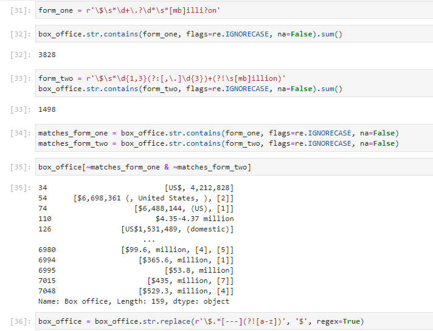
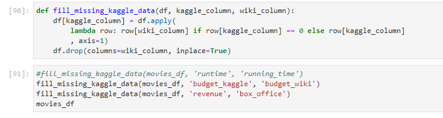

# Movies ETL
This project focused on Extract, Transform and Load on separate databases consisting of movie descriptions and ratings. Data conversion strategies and regular expressions were used to clean the data into a usable form. Data was then exported to an external SQL database.
  
Sample: Using regular expressions to clean "budget" column.

  
Matching columns between two separate datasets.
